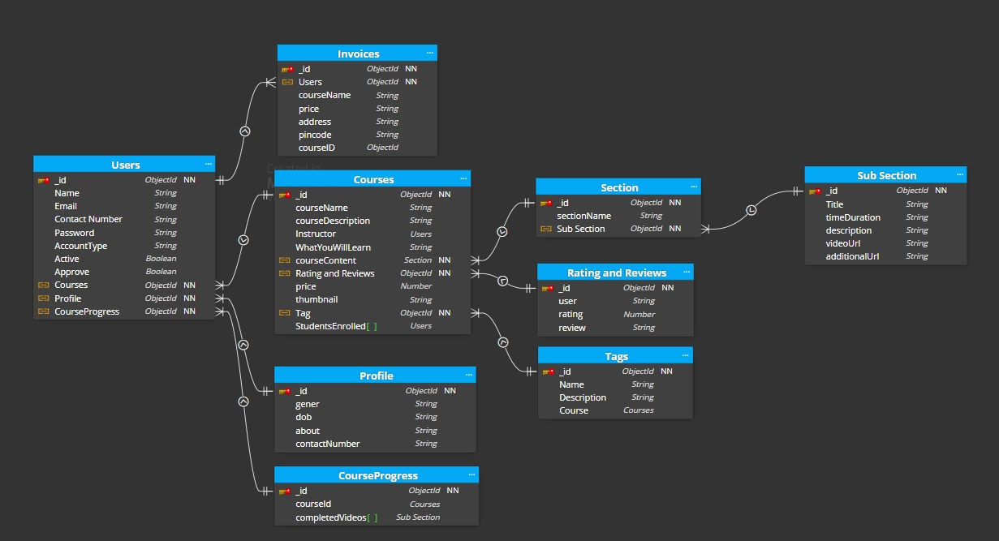

# StudyNotion Ed-Tech Platform

StudyNotion is a versatile and intuitive ed-tech platform that enables users to create, consume, and rate educational content. It provides a seamless and interactive learning experience for students while offering a platform for instructors to showcase their expertise and connect with learners worldwide. The platform is built using the MERN stack, which includes ReactJS, NodeJS, MongoDB, and ExpressJS.

## Table of Contents

- [System Architecture](#system-architecture)
- [Front-end](#front-end)
- [Back-end](#back-end)
- [Database-Schema](#databse-schema)
- [API Design](#api-design)
- [Deployment](#deployment)

---

## System Architecture

The StudyNotion ed-tech platform follows a client-server architecture with the following main components:

- **Front-end**: Built with ReactJS, it communicates with the back end using RESTful API calls.
- **Back-end**: Developed with NodeJS and ExpressJS, it handles user authentication, course management, and more.
- **Database**: Utilizes MongoDB as a NoSQL database to store course content, user data, and other relevant information.

---

## Front-end

The front end of StudyNotion is built with ReactJS, offering a dynamic and responsive user interface for students and instructors. Here are some key pages and functionalities:

**For Students:**

- **Homepage**: Introduction to the platform.
- **Course List**: List of available courses with descriptions and ratings.
- **Wishlist**: Display added courses.
- **Cart Checkout**: Complete course purchase using Razorpay.
- **Course Content**: Access course material, including videos.
- **Enrolled Courses**: Progress and list of enrolled courses.
- **User Details**: Account information.
- **User Edit Details**: Edit account information.

**For Instructors:**

- **Dashboard**: Overview of instructor's courses and ratings.
- **Insights**: Detailed course including the number of views, clicks, and other relevant metrics.
- **Course Management Pages**: Create, update, delete courses.
- **View and Edit Profile Details**: Account management.

Front-end tools and technologies include ReactJS, CSS, Tailwind CSS, Redux for state management, and VSCode for development.
Additionally, we use some npm packages to add extra functionality to the front end.

 

---

## Back-end

The back end of StudyNotion is built with NodeJS and ExpressJS and uses MongoDB as its primary database. Key features and functionalities include:

- **User Authentication and Authorization**: Secure login, OTP verification, and forgot password functionality.
- **Course Management**: Instructors can create, update, delete courses, and students can view and rate them.
- **Payment Integration**: Razorpay integration for course purchases.
- **Cloud-based Media Management**: Cloudinary for storing and managing media content.
- **Markdown Formatting**: Course content is stored in Markdown format for rendering.

**Frameworks, libraries, and tools used**: Node.js, MongoDB, Express.js, JWT for authentication and authorization, Bcrypt for password hashing, and Mongoose for database interaction.

### Data Models 

- **Student Schema**: Includes name, email, password, and course details.
- **Instructor Schema**: Includes name, email, password, and course details.
- **Course Schema**: Includes course name, description, instructor details, and media content.

## Database-Schema

The database for the platform is built using MongoDB, a NoSQL database that provides a flexible and scalable data storage solution. MongoDB allows for the storage of unstructured and semi-structured data. The database stores the course content, user data, and other relevant information related to the platform.

---

## API Design

StudyNotion's API follows the REST architectural style, implemented using Node.js and Express.js. It uses JSON for data exchange and standard HTTP request methods. Sample API endpoints include:

- `POST /api/auth/signup`: Create a new user account.
- `POST /api/auth/login`: Log in and generate a JWT token.
- `POST /api/auth/verify-otp`: Verify OTP sent to the user's email.
- `POST /api/auth/forgot-password`: Send a password reset link.
- `GET /api/courses`: Get a list of all available courses.
- `GET /api/courses/:id`: Get details of a specific course.
- `POST /api/courses`: Create a new course.
- `PUT /api/courses/:id`: Update an existing course.
- `DELETE /api/courses/:id`: Delete a course.
- `POST /api/courses/:id/rate`: Add a course rating (out of 5).

Sample API requests and responses:
- `GET /api/courses`: Get all courses
- Response: A list of all courses in the database
- `GET /api/courses/:id`: Get a single course by ID
- Response: The course with the specified ID
- `POST /api/courses`: Create a new course
- Request: The course details in the request body
- Response: The newly created course
- `PUT /api/courses/:id`: Update an existing course by ID
- Request: The updated course details in the request body
- Response: The updated course
- `DELETE /api/courses/:id`: Delete a course by ID
- Response: A success message indicating that the course has been deleted.

---

## Deployment

StudyNotion is deployed on various cloud-based services:

- Front-end: Vercel for static site hosting.
- Back-end: Render or Railway for Node.js and MongoDB hosting.
- Media Files: Cloudinary for media content storage.
- Database: MongoDB Atlas for database hosting.

This infrastructure ensures scalability, security, and reliability.

---

Thank you for using StudyNotion!

